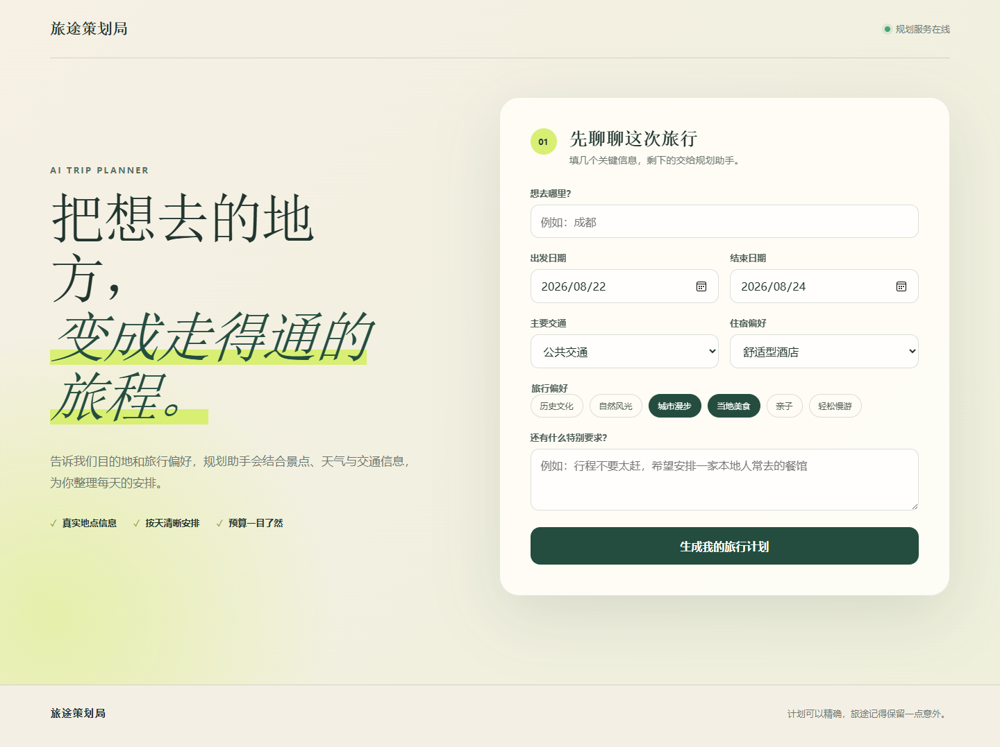
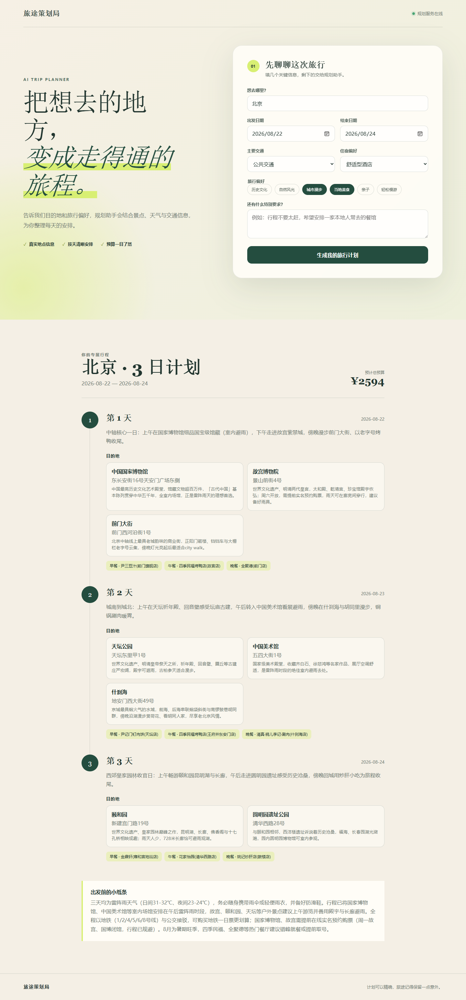
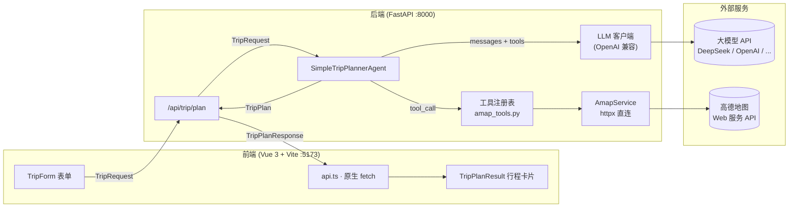

<div align="center">

# 🧭 智能旅行助手 · Intelligent Trip Planner

**一个用于学习 Agent 原理的实践项目 —— 从零手写一个基于「单 Agent + 原生 Function Calling」的旅行规划助手，不依赖任何 Agent 框架。**

*输入目的地、日期和偏好，Agent 会自动查询真实景点、天气与交通，生成逐日可执行的行程方案；更重要的是，整份代码本身就是一份可运行的「Agent 内部原理」学习笔记。*

</div>

---

## 📌 项目简介

这是一个前后端分离的智能旅行规划应用。用户在前端填写目的地、日期范围、交通方式、住宿偏好和旅行兴趣标签，后端 Agent 通过**多轮工具调用**（POI 搜索、天气查询、路线规划）收集真实地理数据，最终生成一份包含每日景点、三餐安排、住宿与预算的完整行程。

与其他教程项目最大的不同：**本项目不使用任何 Agent 编排框架**（如 LangChain / hello-agents），Agent 的核心循环、工具桥接、JSON 解析与容错逻辑全部手写，力求把「Agent 到底是怎么工作的」这件事讲清楚。

## 📸 界面预览

**首页** —— 填写目的地、日期与旅行偏好：



**规划结果** —— 北京 3 日游示例（真实景点、三餐与预算，天气联动）：



## 🎓 这是一个 Agent 学习项目

> 这个仓库首先是一份学习材料，其次才是一个可用的应用。

它要回答一个问题：**「Agent 到底是怎么工作的？」** 当 LangChain、hello-agents 等框架把 Agent 封装成几行代码时，我想弄清楚那几行代码背后到底发生了什么。

下面这张表把 Agent 的核心概念，一一对应到本仓库里可逐行调试的代码：

| 学习主题 | 对应代码 | 你会搞懂什么 |
|---|---|---|
| **Function Calling（工具调用）** | `agent/trip_planner.py` 主循环 | Agent 如何通过 `tools` 参数让 LLM 决定「下一步调用哪个函数」 |
| **Agent Loop 与消息协议** | `agent/trip_planner.py` `_assistant_message_to_dict` | `system / user / assistant / tool` 四种角色如何组装与回填，`tool_call_id` 为何必须原样带回 |
| **结构化输出** | `agent/trip_planner.py` `extract_json` | 如何让 LLM 输出 JSON、如何三级提取（围栏 / 裸花括号）、如何用 Pydantic 校验并重试 |
| **Agent 容错设计** | `agent/tools/amap_tools.py` + fallback | 「永不崩溃」的三层防御：handler 不抛异常 / JSON 提取 / 校验重试 + 兜底 |
| **Prompt Engineering** | `agent/prompts/trip_planner.py` | 一份能约束 Agent 工作流程与输出格式的 system prompt 长什么样 |
| **工具协议取舍** | 全项目 vs 参考仓库 | MCP（子进程）与原生函数调用（直连 REST）两种工具接入方式的区别与取舍 |
| **单 Agent vs 多 Agent** | `agent/base.py` + `trip_planner.py` | 为什么旅行规划用单 Agent 就够，什么场景才需要多 Agent 编排 |
| **LLM 客户端抽象** | `core/llm.py` | 如何封装 OpenAI 兼容接口，让 DeepSeek / OpenAI / Kimi 一键切换 |
| **工具函数设计** | `agent/tools/amap_tools.py` | 工具 handler 的三条铁律：永不抛异常、防御性解析、结果裁剪省 token |

**建议的阅读顺序**（从外围数据到核心循环，逐步逼近）：

```
schemas（数据契约）→ core/llm.py（LLM 客户端）→ agent/tools（工具）→ agent/trip_planner.py（主循环）→ api（对外暴露）
```

配套的 [docs/IMPLEMENTATION_GUIDE.md](docs/IMPLEMENTATION_GUIDE.md) 记录了从 0 到 1 的完整推导过程，以及实现过程中踩过的 11 个坑 —— 那是最接近「我在想什么」的部分。

## 🌱 想法来源

本项目的灵感来自 **Datawhale** 的开源教程仓库 👉 **[hello-agents](https://github.com/datawhalechina/hello-agents)**，具体是其中第 13 章的示例项目：

> [`datawhalechina/hello-agents/tree/main/code/chapter13/helloagents-trip-planner`](https://github.com/datawhalechina/hello-agents/tree/main/code/chapter13/helloagents-trip-planner)

那个项目是一个优秀的教学案例，它基于 hello-agents 框架，用以下方式构建旅行规划 Agent：

- **`SimpleAgent`** —— 框架提供的 Agent 基类，负责编排「思考 → 调用工具 → 整合」的循环
- **`HelloAgentsLLM`** —— 框架封装的大模型客户端（支持 OpenAI、DeepSeek 等）
- **`MCPTool`** —— 通过 **MCP（Model Context Protocol）** 协议接入高德地图工具，底层以子进程方式拉起 `uvx amap-mcp-server`
- 前端使用 **Ant Design Vue** + **高德地图 JS API**（地图打点展示）+ Axios

它教会了我「一个旅行 Agent 长什么样」。但我在学习时产生了一个强烈的疑问：**如果剥掉框架，Agent 的循环、工具调用、消息组装到底是怎么运转的？** 于是有了本项目 —— 把 hello-agents 这层「黑盒」拆开，用最少的代码把同样的事重新实现一遍。

## 🔍 我的不一样的设计

下面这张表对比了参考仓库与本项目在关键维度上的不同选择。**两者没有优劣之分**：参考仓库展示了「用框架快速搭建」的生产范式，本项目则聚焦于「理解并掌控 Agent 的每一行细节」。

| 维度 | 参考仓库（hello-agents） | 本项目 |
|---|---|---|
| **Agent 编排** | `SimpleAgent` 框架类 | 手写 tool-calling 循环（约 100 行核心代码） |
| **工具协议** | MCP（`MCPTool` + `uvx amap-mcp-server` 子进程） | 直接用 `httpx` 调高德 REST API，无子进程、无协议层 |
| **LLM 客户端** | `HelloAgentsLLM` 封装 | `openai` SDK 原生 `chat.completions`（兼容任意 OpenAI 接口） |
| **前端 UI** | Ant Design Vue | 零 UI 库，手写 CSS |
| **地图展示** | 高德 JS API 地图打点 | 纯行程卡片（经纬度坐标仍保留在响应数据中） |
| **HTTP 客户端** | Axios | 原生 `fetch` |
| **数据契约** | 普通 Pydantic | Pydantic v2 `frozen` 不可变模型 + `pydantic-settings` 启动即校验密钥 |
| **容错机制** | 依赖框架默认行为 | 三层防御（详见下文），保证前端**永远**拿到合法结构 |
| **测试** | —— | 80 个测试、87% 覆盖率，全部 mock、零 token 成本 |

### 三个最核心的设计决策

**决策一：单 Agent + 原生 Function Calling，而不是多 Agent 编排**

参考仓库用了框架的 `SimpleAgent`。我拆解后发现，旅行规划的本质是「一个会调用工具的循环」，单 Agent 完全够用，引入多 Agent 只会增加复杂度。因此我直接使用 OpenAI 兼容接口原生的 `tools` 参数实现 function calling，把 Agent 循环收敛为一段可读性极高的代码：

```python
for _ in range(MAX_ITERATIONS):                    # 最多 10 轮，防止死循环烧 token
    message = llm.chat(messages, tools=TOOL_SCHEMAS)  # 模型自己决定：继续调工具 or 输出结果
    messages.append(assistant_message)              # 带 tool_calls 的 assistant 消息必须回填
    if not message.tool_calls:
        break                                       # 没有工具调用 = 拿到最终 JSON
    for tool_call in message.tool_calls:
        result = await handler(tool_call.function.arguments)
        messages.append({"role": "tool", "tool_call_id": tool_call.id, "content": result})
```

**决策二：放弃 MCP，直连高德 REST API**

参考仓库通过 MCP 子进程调用高德工具。我选择直接用 `httpx` 调高德 Web 服务 REST 接口，原因有三：
1. **更可控** —— 不必依赖 `amap-mcp-server` 这个外部进程的可用性
2. **更易调试** —— 每个请求的 URL、参数、返回都清晰可见
3. **逼出真问题** —— 直连后踩到了三个高德 API 的「坑」，这正是学习价值所在（详见下文「高德 API 三个坑」）

**决策三：三层防御，让 Agent 永不崩溃**

参考仓库在容错上依赖框架默认行为。我则显式构建了三层防线，保证无论 LLM 或外部 API 出什么问题，前端都能拿到合法数据：

1. **工具层**：handler 永不抛异常，任何失败都返回 `{"error": "..."}` JSON 字符串
2. **解析层**：JSON 提取三级策略（```json 围栏 → 普通围栏 → 首尾花括号）
3. **兜底层**：pydantic 校验失败 → 让 LLM 修正重试 1 次 → 仍失败则生成骨架行程（fallback plan）

## 🏗️ 系统架构



**核心数据流**：

1. 前端提交 `TripRequest` → 后端 `/api/trip/plan`
2. Agent 组装 `[system, user]` 消息 → 调用 LLM
3. LLM 决定调用哪些工具（`search_poi` / `get_weather` / `plan_route` / `geocode`）
4. 工具 handler 通过 `AmapService` 直连高德 API，返回裁剪后的结果
5. 循环直到 LLM 输出最终 JSON → 提取 + 校验 → 生成 `TripPlan`
6. 后端包进统一信封 `TripPlanResponse` 返回前端渲染

## ✨ 功能特性

- 🎯 **真实地理数据**：景点、餐厅、酒店均来自高德 POI 搜索，坐标原样引用，绝不编造
- 🌦️ **天气联动**：根据目的地天气预报智能调整行程（如雨天优先安排室内景点）
- 🚇 **路线验证**：可选调用路线规划，判断景点间是否顺路、估算通行时间
- 🛡️ **永不崩溃**：三层防御机制，任何异常都退化为合法结构返回前端
- 📐 **类型安全**：`pydantic-settings` 启动即校验缺失密钥，前后端契约严格对齐
- 🧩 **零框架依赖**：Agent 编排、工具桥接、LLM 客户端全部手写，仅依赖 `openai` SDK 做 HTTP 通信
- 🧪 **完整测试**：80 个测试、87% 覆盖率，全部 mock、零 token 成本

## 🧰 技术栈

### 后端

| 组件 | 用途 |
|---|---|
| Python 3.12+ | 运行时 |
| [FastAPI](https://fastapi.tiangolo.com/) | Web 框架 |
| [Pydantic v2](https://docs.pydantic.dev/) | 数据校验（frozen 不可变模型） |
| [pydantic-settings](https://docs.pydantic.dev/latest/concepts/pydantic_settings/) | 类型化配置，启动即校验 |
| [httpx](https://www.python-httpx.org/) | 异步 HTTP 客户端（调高德 API） |
| [openai](https://github.com/openai/openai-python) | OpenAI 兼容接口客户端 |
| [uv](https://github.com/astral-sh/uv) | 包管理 + 依赖锁定 |
| pytest / pytest-asyncio / pytest-cov | 测试框架 |

### 前端

| 组件 | 用途 |
|---|---|
| Vue 3.5 + TypeScript | 框架 |
| [Vite 7](https://vitejs.dev/) | 构建与开发服务器（含 `/api` 代理） |
| 原生 `fetch` | HTTP 通信（无 Axios） |
| 手写 CSS | 样式（无 UI 组件库） |

## 📂 目录结构

```
trip-planner/
├── backend/                       # FastAPI 后端
│   ├── app/
│   │   ├── agent/                 # ★ Agent 核心（本项目灵魂）
│   │   │   ├── base.py            #   TripPlannerAgent 协议（接口契约）
│   │   │   ├── trip_planner.py    #   单 Agent 实现：主循环 / JSON 提取 / 重试 / fallback
│   │   │   ├── tools/
│   │   │   │   └── amap_tools.py  #   4 个工具 handler + OpenAI 格式 schema
│   │   │   └── prompts/
│   │   │       └── trip_planner.py#   system prompt + user message 模板
│   │   ├── api/
│   │   │   ├── router.py          #   /api 前缀聚合
│   │   │   └── routes/            #   health.py / map.py / trip.py
│   │   ├── core/
│   │   │   ├── llm.py             #   OpenAI 兼容 LLM 客户端
│   │   │   └── logging.py         #   日志配置
│   │   ├── services/
│   │   │   └── amap_service.py    #   高德 REST 客户端（含三个坑的解法）
│   │   ├── schemas/               #   Pydantic 数据契约（与前端严格对齐）
│   │   ├── config.py              #   pydantic-settings 配置
│   │   └── main.py                #   FastAPI 入口（CORS + lifespan + 异常处理）
│   ├── tests/                     # 80 个测试，覆盖率 87%
│   ├── .env.example               # 环境变量模板
│   ├── pyproject.toml
│   └── README.md                  # 后端详细文档
├── frontend/                      # Vue 3 前端
│   ├── src/
│   │   ├── components/            # TripForm.vue / TripPlanResult.vue
│   │   ├── services/api.ts        # 原生 fetch 封装
│   │   ├── types/trip.ts          # TS 类型（后端 schema 的镜像）
│   │   └── App.vue / main.ts
│   ├── .env.example
│   ├── vite.config.ts             # 含 /api、/health 代理
│   └── README.md
└── docs/
    └── IMPLEMENTATION_GUIDE.md    # 完整实现手册（11 步 + 踩坑清单）
```

## 🚀 快速开始

> 需要两个终端：一个跑后端，一个跑前端。整体流程约 2 分钟。

### 前置条件

- Python 3.12+
- [uv](https://github.com/astral-sh/uv)（后端包管理）
- Node.js 18+（前端）

### 第一步：启动后端

```bash
cd backend

# 1. 配置密钥（必填，否则启动报错）
cp .env.example .env
# 编辑 .env，填入两个密钥：
#   LLM_API_KEY=sk-xxxx          （OpenAI 兼容接口的 API Key）
#   AMAP_API_KEY=你的高德Key      （高德「Web 服务」类型 Key）

# 2. 安装依赖
uv sync

# 3. 启动服务
uv run uvicorn app.main:app --reload
```

后端启动后，访问 http://127.0.0.1:8000/docs 查看 Swagger API 文档。

### 第二步：启动前端

```bash
cd frontend

# 1. 配置（默认已指向本地后端，通常无需修改）
cp .env.example .env

# 2. 安装依赖
npm install

# 3. 启动开发服务器
npm run dev
```

浏览器打开 **http://localhost:5173**，右上角显示「规划服务在线」即表示前后端已连通。

### 申请高德地图 Key（重要）

1. 访问 [高德开放平台](https://console.amap.com/) 注册并登录
2. 创建应用 → 添加 Key，**类型必须选「Web 服务」**（不是「Web 端（JS API）」）
3. 复制 Key 填入 `backend/.env` 的 `AMAP_API_KEY`

> ⚠️ 个人开发者账号 QPS 配额较低，短时间高频调用会报 `CUQPS_HAS_EXCEEDED_THE_LIMIT`。Agent 已内置容错，会自动重试或调整策略。

## 🧠 核心原理

### Agent 循环（最关键的代码）

见上文「决策一」，核心是一个 `for` 循环：每轮把消息发给 LLM，LLM 要么返回 `tool_calls`（继续调工具），要么返回最终文本（结束循环）。两个最容易踩的坑都已处理：

1. **带 `tool_calls` 的 assistant 消息必须原样回填**，否则下一轮对话格式非法（OpenAI 协议硬性要求）
2. **`tool` 消息必须携带原 `tool_call_id`**，缺失会导致 API 返回 400

### 高德 API 三个坑（直连才暴露的真问题）

| 坑 | 现象 | 解法 |
|---|---|---|
| 天气接口只认 `adcode` | 传城市名（如「北京」）直接报错 | `get_weather()` 内部先调用 `geocode` 把城市名转成 adcode，并缓存结果 |
| 路线接口只认坐标 | 传地址（如「故宫」）报错 | `plan_route()` 内部先对起终点做地理编码，得到 `"lng,lat"` 再请求 |
| 字段缺失返回 `[]` | `address` 等字段可能是数组而非字符串 | 统一 `_as_str()` 防御，把所有可能返回 `[]` 的字段安全转成字符串 |

> 这三个坑在参考仓库里被 MCP server 屏蔽了 —— 这正是「不用框架直连」带来的额外学习收获。

### 三层防御（永不崩溃）

```
┌─ 第一层：工具 handler ─────────────────────────┐
│  任何异常（参数非法 / API 限流 / 网络错误）      │
│  → 捕获后返回 {"error": "..."} JSON 字符串       │
│  → 绝不向上抛异常                               │
└───────────────────────────────────────────────┘
┌─ 第二层：JSON 提取 ────────────────────────────┐
│  模型输出可能带 ```json 围栏、解释文字、空内容   │
│  → 三级策略：json 围栏 → 普通围栏 → 首尾花括号   │
│  → 全部失败才抛异常                             │
└───────────────────────────────────────────────┘
┌─ 第三层：校验重试 + 兜底 ──────────────────────┐
│  pydantic 校验失败 → 把错误回给 LLM 修正 1 次    │
│  仍失败 → 生成 N 天骨架行程（fallback plan）     │
│  → 前端永远拿到结构合法的 TripPlan              │
└───────────────────────────────────────────────┘
```

## 🧪 测试

```bash
cd backend
uv run pytest                          # 80 个测试
uv run pytest --cov=app --cov-report=term-missing   # 覆盖率 87%
```

| 测试文件 | 覆盖内容 | 手法 |
|---|---|---|
| `test_schemas.py` | 数据契约校验（日期格式、字段必填） | 纯单元测试 |
| `test_config.py` | 配置启动校验（密钥缺失报错） | monkeypatch 环境变量 |
| `test_amap_service.py` | 高德服务解析（坐标拆分、`[]` 防御、status 检查） | `httpx.MockTransport` 不联网 |
| `test_amap_tools.py` | 工具 handler 三层铁律 | StubService 注入 |
| `test_prompts.py` | 提示词完整性 | 纯断言 |
| `test_trip_planner.py` | Agent 主循环、重试、fallback、循环耗尽 | `FakeLLM` 脚本化返回 |
| `test_api.py` | 路由层信封、异常分支 | `TestClient` + Stub |

> 💡 **零 token 成本**：所有涉及 LLM 和外部 API 的测试都通过 mock（`FakeLLM` / `MockTransport` / Stub）完成，跑一遍测试套件不花一分钱 API 费用。

## 📖 更多文档

- **[docs/IMPLEMENTATION_GUIDE.md](docs/IMPLEMENTATION_GUIDE.md)** —— 完整的 11 步实现手册，含架构图、消息序列示例、11 条踩坑清单
- **[backend/README.md](backend/README.md)** —— 后端详细文档（API 说明、常见问题、部署指南）
- **[frontend/README.md](frontend/README.md)** —— 前端启动与接口约定

## 🙏 致谢

- **感谢 [Datawhale](https://github.com/datawhalechina) 与 [hello-agents](https://github.com/datawhalechina/hello-agents) 团队**，你们的教程和示例项目是本文档想法的直接来源。
- 感谢 [高德开放平台](https://lbs.amap.com/) 提供的地图与天气 Web 服务。
- 感谢 [OpenAI](https://platform.openai.com/) 定义的 function calling 协议，以及 [DeepSeek](https://www.deepseek.com/) 等提供的 OpenAI 兼容接口。

## 📄 License

本项目采用 [MIT License](LICENSE) 开源，Copyright © 2026 SunHD11。你可以自由使用、修改和分发。

---

<div align="center">

**⭐ 如果这个项目对你有帮助，欢迎给一个 Star！**

</div>
